# README

## 🌌 프로젝트 진행 기간

---

2023.04.10 ~ 2023.05.19

SSAFY 8기 2학기 자율프로젝트 - Eye Can Speak

## 🌌 Eye Can Speak - 배경 및 개요

---

시선 추적 기술 (Eye Tracking) 기술을 이용하여 생산성있는 작업을 할 수 있는 컨텐츠를 제공합니다. 
안구 움직임 영상 데이터를 기반으로 AI모델을 이용해 학습하여 사용자의 시선을 추적하고 안구 움직임을 판단하여 시스템을 제어 및 그림그리기, 타이핑 등 콘텐츠를 제공합니다.

## ✅ 프로젝트 목표

---

1.	환자들 간 유대감형성
-	사용자 작업물을 생성하고 사용자간 공유하여 커뮤니티 및 유대감을 제공합니다.
2.	컨텐츠 제공
-	시선 추적을 통해 사용자가 재미있게 참여할 수 있는 다양한 컨텐츠를 제공합니다.
3.	안구 건강 
-	쉽게 따라할 수 있는 안구 운동 서비스를 제공하여 사용자가 재미있게 안구를 건강하게 합니다.

---

## ✅ 주요 기술

---

### Backend

- IntelliJ
- Spring boot
- Spring Data Jpa
- Spring Security
- MariaDB

### Frontend

- Javascript
- React
- Recoil
- node.js
- Typescript

### CI/CD

- AWS EC2
- Docker
- Jenkins
- Nginx

### AI

- flask

## ✅ 협업 툴

---

- Git
- Notion
- Jira
- MatterMost
- Figma

## ✅ 협업 환경

---

- GItlab
  - 코드 버전 관리
  - MR를 통한 코드 리뷰
  - git flow 전략
- JIRA
  - 매주 목표 설정
  - 스프린트를 통해서 팀원이 현재 하고 있는 작업 확인
  - 번다운 차트를 통해서 한주의 작업 분석
- Notion
  - 프로젝트 일정 관리
  - 회의록 정리
  - 컨벤션 정리
  - 기능 명세서 정리
  - API 및 ERD 문서 정리
  - 각종 자료 공유
- 스크럼
  - 매일 아침 약 10분 내외로 각자의 진행상황 등을 공유

## ✅ Figma

---

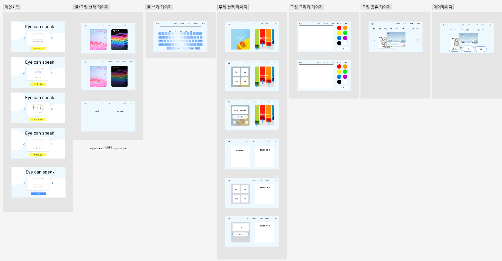

  ## ✅ ERD
  ---

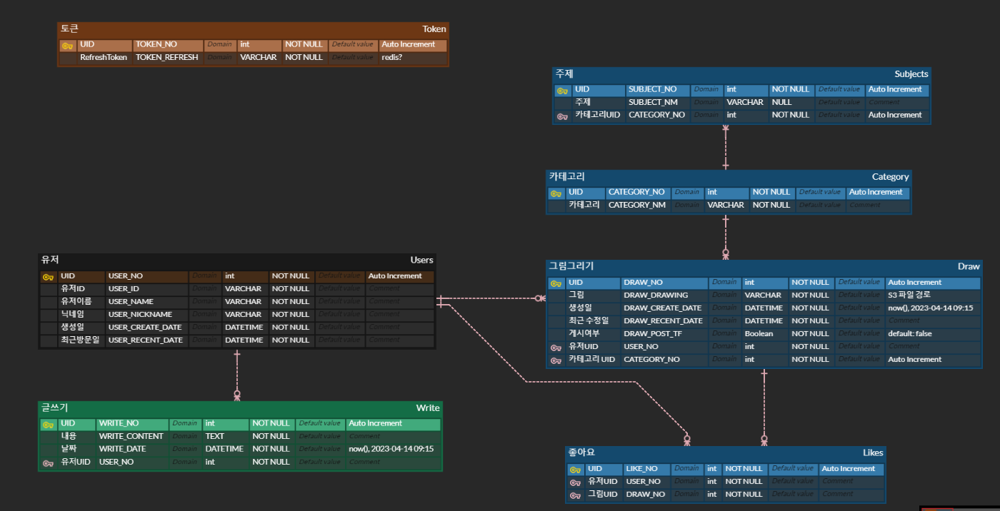

## 📱 시연 시나리오

---

### 시작 화면 - 로그인 전

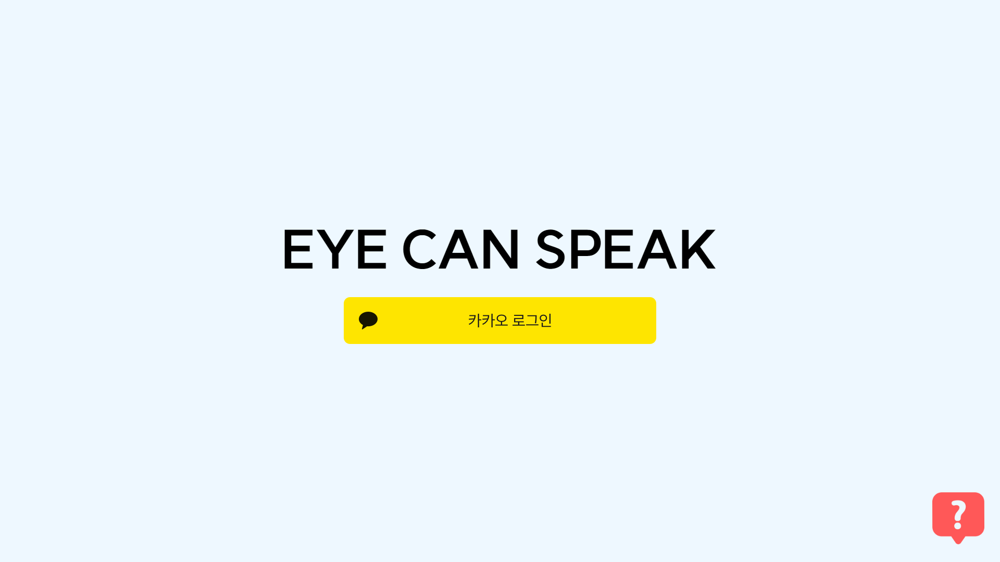

### 시작 화면 - 로그인 후

- 카카오 로그인 완료 시 로그인 버튼 → 시작하기 버튼으로 전환
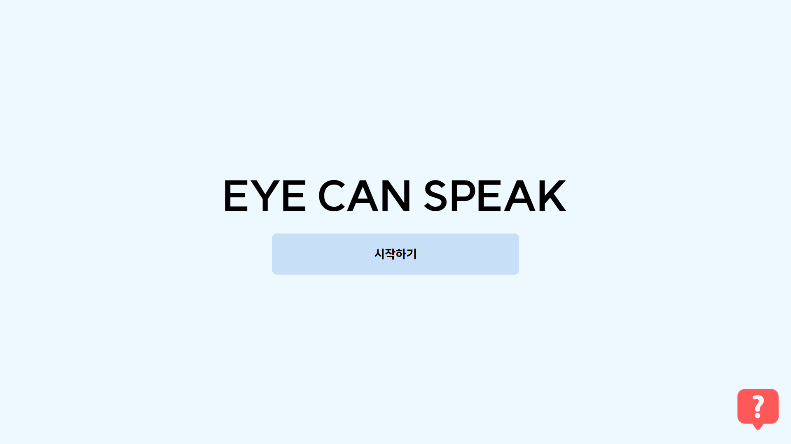

### 도움말 모달

- 시작 화면의 우하단 물음표 클릭 시 서비스 사용법 안내

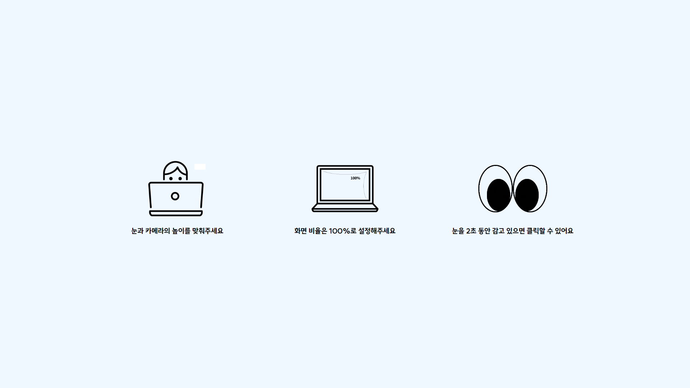

### 초기 설정 화면

- 사용자 초점의 기준점을 잡기 위해  초기 설정

### 메인 화면

- 초기 설정을 바탕으로 사용자의 눈동자 이동 방향을 인식하여 마우스 조작
- 좌하단의 조이스틱을 이용해 현재 눈동자 이동 방향 확인 가능
- 우하단의 설정 버튼 클릭 시 눈 초점 재설정 가능

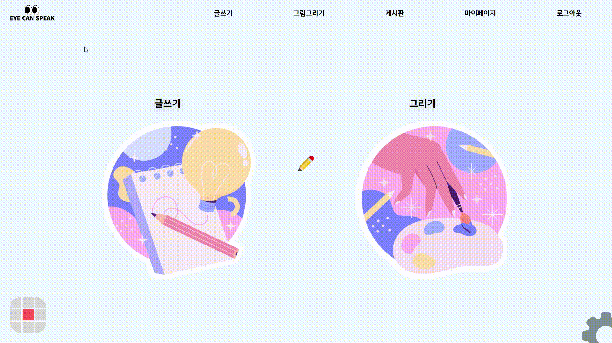

### 글쓰기 화면

- 마우스를 이용해 키보드를 조작해 문장 입력
- 입력한 문장으로 TTS 이용 가능

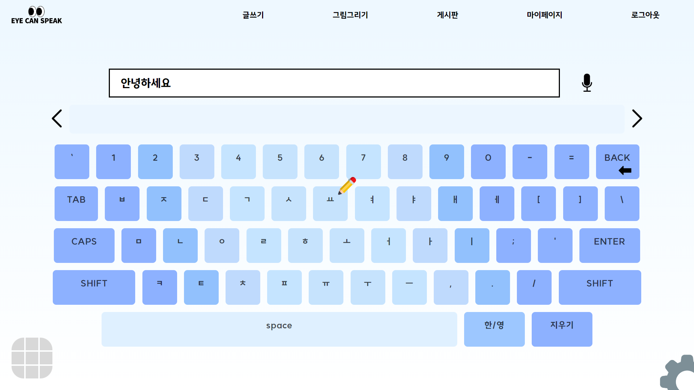

### 그림 그리기 화면

- 주어진 주제로 그림을 그리거나 자유롭게 그림 그리기 가능

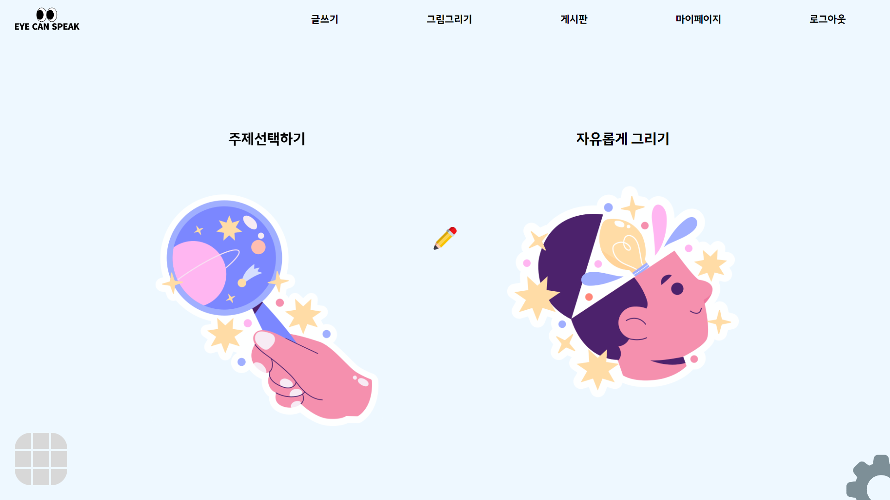

### 그림 그리기 화면

- 마우스를 이용한 그림 그리기
- 펜 색상, 굵기 변경 가능

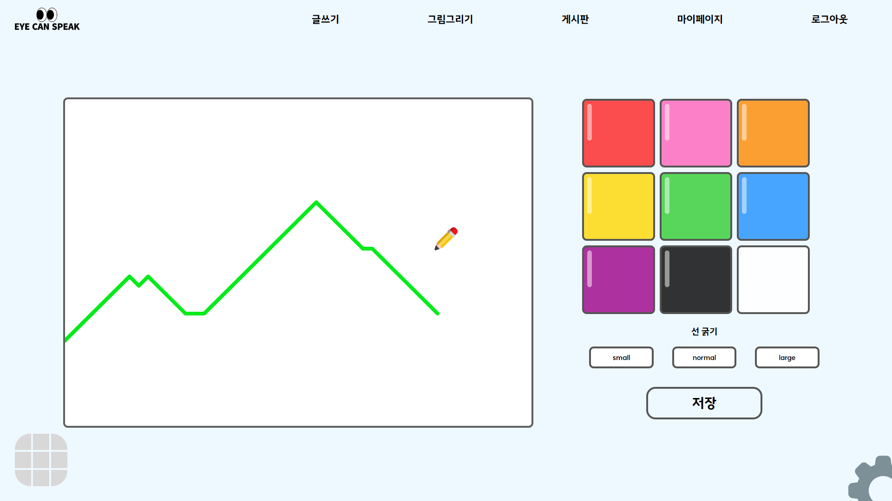

### 게시판 화면

- 다른 이용자들의 그림 조회
- 카테고리별, 최신순, 인기순으로 조회 가능
- 좋아요를 통해 인기순에 반영

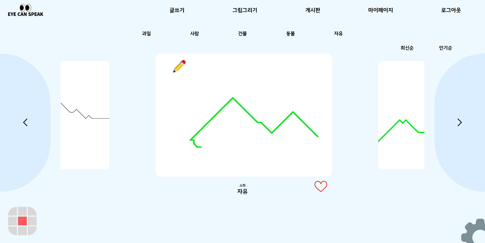

### 그림 그리기 화면

- 마우스를 이용한 그림 그리기
- 펜 색상, 굵기 변경 가능

### 마이 페이지 화면

- 이용자가 그린 그림 조회
- JPG 형식으로 그림 다운로드, 그림 수정, 삭제

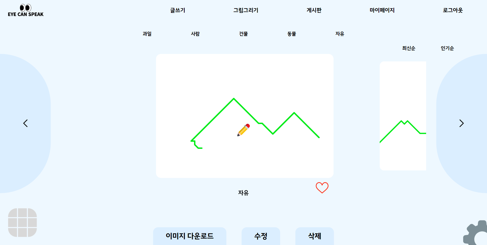
